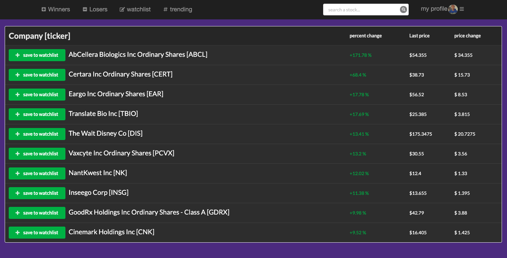
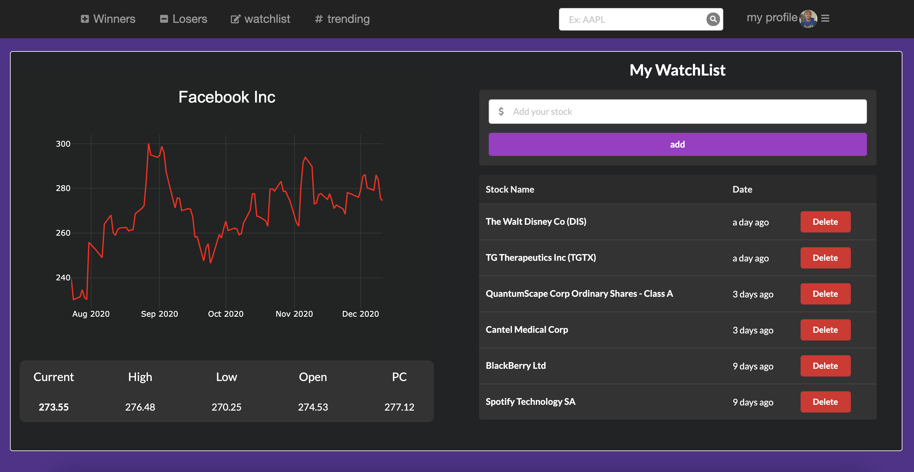

# 10/10 stock tracker

Add stocks to your watchList with the 10/10 stock tracking app. It will give users insight on top 10 daily stock gainers and losers, Allow you to search for any stock in the market, as well as share and connect with a community. 

## Motivation

Our motivation when building this application was to provide users with informative insight on the stock market, and to encourage people from all backgrounds to become an informed investor. Our group focused on creating an inviting atmosphere for people unfamiliar with the stock market.

## Installation 

To install all necessary dependencies, open the terminal inside youre root folder and run 'npm i'. 

## Getting Started

Run 'npm start' inside your root terminal.

## App Tutorial

View the top 10 stock Market daily winners and losers, and lookup any stock.
Open the winners or losers tab to check the daily stock market winners and losers. In the search bar, you can search stocks by their ticker to find extra information and details about the company.

 
Create your personal stocks watchlist and join the 10/10 stock community to view trends.
You can also enter stocks onto the watchlist to manage and keep track of your favorite stocks. The community tab will allow you to view popular stocks among other users.

 

## Technologies

* [HTML](https://developer.mozilla.org/en-US/docs/Web/HTML)
* [CSS](https://developer.mozilla.org/en-US/docs/Web/CSS)
* [Javascript](https://developer.mozilla.org/en-US/docs/Web/JavaScript)
* [Semantics-UI React](https://react.semantic-ui.com/)
* [NodeJs](https://developer.mozilla.org/en-US/docs/Glossary/Node.js)
* [ReactJs](https://developer.mozilla.org/en-US/docs/Learn/Tools_and_testing/Client-side_JavaScript_frameworks/React_getting_started)
* [MongoDb](https://www.mongodb.com/cloud/atlas/lp/try2?utm_source=google&utm_campaign=gs_americas_united_states_search_brand_atlas_desktop&utm_term=mongodb&utm_medium=cpc_paid_search&utm_ad=e&utm_ad_campaign_id=1718986498&gclid=Cj0KCQjwzbv7BRDIARIsAM-A6-2M3idV1X1f4PeHuJ9j77PNXa9d7p4AZa0zlIgQ395ijXQ-4sbPWRsaAuo7EALw_wcB)
* [PassportJs](http://www.passportjs.org/packages/passport-jwt/)

## Deployed Link

* [See Live Site](https://thawing-bastion-89215.herokuapp.com/)

## Authors

Fanuel Alem, Ganesh nimavat, HusamAhalim, Vanessa Emerick,

- [Link to Portfolio Site](https://fanuel-react-app.herokuapp.com/)
- [Link to Github](https://github.com/fanuelalem/basic-portfolio-new)
- [Link to LinkedIn](https://www.linkedin.com/in/fanuel-alem-12991b32/)

See also the list of [contributors](https://github.com/fanuelalem/Project-3/graphs/contributors) who participated in this project.

## License

This project is licensed under the MIT License 

## Acknowledgments

* professorHat tip to anyone whose code, libraries, packages, or UI was used  / inspired from
* teacher assistants