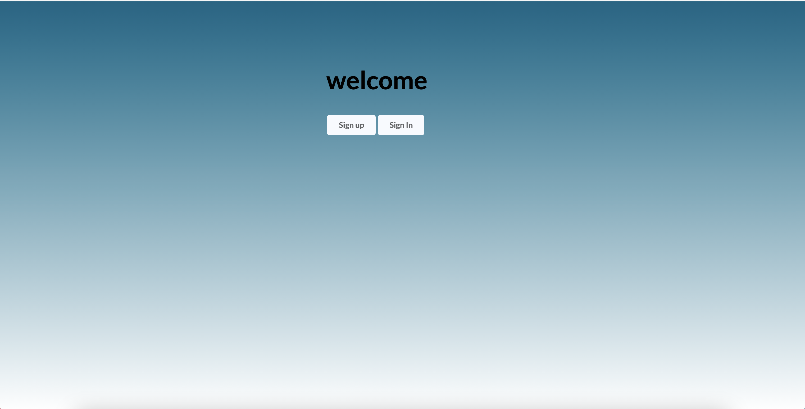

# Carna Take Home Project

Choose to be either an admin/teacher to assign courses and keep track of your students grades, or enroll to a teacher's curriculum and take their exams. 

## Motivation

My motivation in building the project was to make an exceptional academic platform that was helpful to manage teacher students and easy to use. My goal was to meet the standards required of providing a positive experience in learning

## Installation 

To install all necessary dependencies, open the terminal inside youre root folder and run 'npm i'. 

## Getting Started

Run 'npm start' inside your root terminal.

## App Tutorial

 When you signin/signup as a teacher, you will be given options of courses that you can add to your curruculum where your students will stay updated on. When you sign in/signup as a student, you will be given options of available teachers with the courses of your preference. Take an exam and improve your over all grade. 

 

## Technologies

* [HTML](https://developer.mozilla.org/en-US/docs/Web/HTML)
* [CSS](https://developer.mozilla.org/en-US/docs/Web/CSS)
* [Javascript](https://developer.mozilla.org/en-US/docs/Web/JavaScript)
* [Semantics-UI React](https://react.semantic-ui.com/)
* [NodeJs](https://developer.mozilla.org/en-US/docs/Glossary/Node.js)
* [ReactJs](https://developer.mozilla.org/en-US/docs/Learn/Tools_and_testing/Client-side_JavaScript_frameworks/React_getting_started)
* [MongoDb](https://www.mongodb.com/cloud/atlas/lp/try2?utm_source=google&utm_campaign=gs_americas_united_states_search_brand_atlas_desktop&utm_term=mongodb&utm_medium=cpc_paid_search&utm_ad=e&utm_ad_campaign_id=1718986498&gclid=Cj0KCQjwzbv7BRDIARIsAM-A6-2M3idV1X1f4PeHuJ9j77PNXa9d7p4AZa0zlIgQ395ijXQ-4sbPWRsaAuo7EALw_wcB)
* [PassportJs](http://www.passportjs.org/packages/passport-jwt/)

## Deployed Link

* [See Live Site](https://carnatakehomeproject.herokuapp.com/)

## Authors

Fanuel Alem

- [Link to Portfolio Site](https://fanuel-react-app.herokuapp.com/)
- [Link to Github](https://github.com/fanuelalem/basic-portfolio-new)
- [Link to LinkedIn](https://www.linkedin.com/in/fanuel-alem-12991b32/)

See also the list of [contributors](https://github.com/fanuelalem/CarnaApp/graphs/contributors) who participated in this project(me).

## License

This project is licensed under the MIT License 

## Acknowledgments

* professorHat tip to anyone whose code, libraries, packages, or UI was used  / inspired from
* teacher assistants